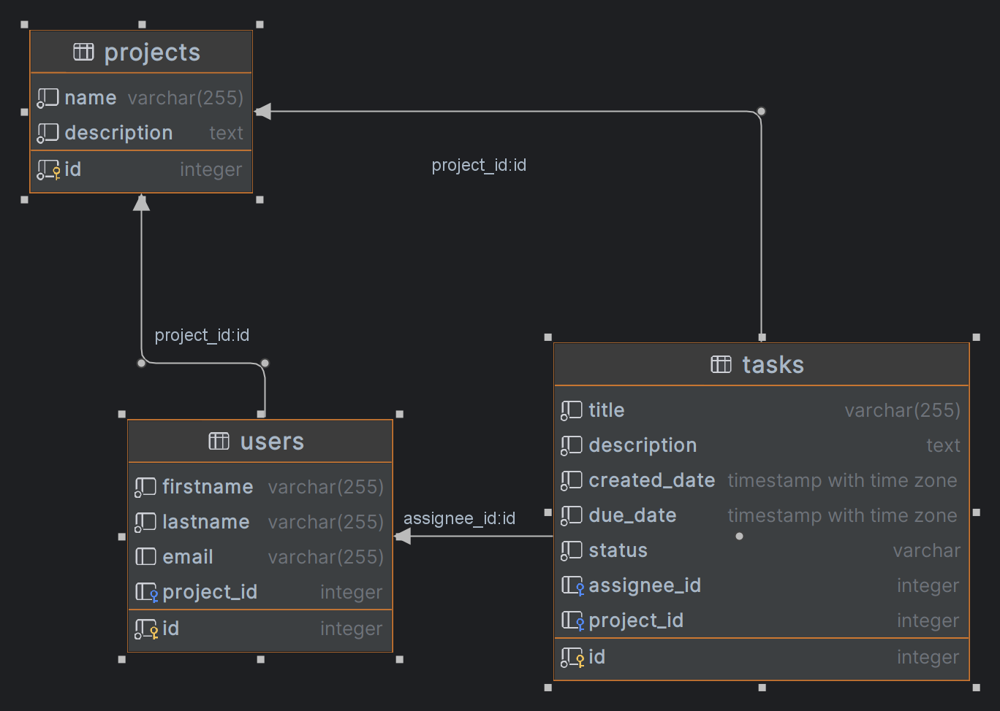

# application

The `application` project is a library that can be used as the solution by creating a business abstraction or
may extend an existed implementation to provide such software solutions as: CRUD services, REST, DI.

Architecture
This is a high-level abstraction based on the low-level API. It has been written without frameworks and delivered with
one dependency:

&#8658; JSON simple (https://cliftonlabs.github.io/json-simple/) <br/>
&#8658; Reflections (https://github.com/ronmamo/reflections) <br/>

## How to Run:

1) git clone https://github.com/Viktorsee0/application-task.git
2) **`cd ./application-task/docker/docker-compose`**
3) **`docker compose up -d --build`**</br>

## To Stop:

1) **`docker compose down`**

## Configuration and Usage

```java

@Configuration
public class BDConfiguration {
    @ComponentFactory
    public DataSource getDataSource() {
        final HikariDataSource dataSource = new HikariDataSource();
        dataSource.setDriverClassName(driverClass);
        dataSource.setJdbcUrl(jdbcUrl);
        dataSource.setMaximumPoolSize(Runtime.getRuntime().availableProcessors() * 2 + 1);
        dataSource.addDataSourceProperty("user", user);
        dataSource.addDataSourceProperty("password", password);
        return dataSource;
    }
}

@Configuration
public class ServerConfiguration {
    @ComponentFactory
    public ServerConfig getServerConfig() {
        return new com.spg.applicationTask.engine.web.ServerConfig.Builder()
                .property(Property.HOST, host)
                .property(Property.PORT, port)
                .build();
    }
}
```

### REST Usage

The REST API is available via the `http` protocol:

**`POST localhost:8000/user`** - return list of created or updated users, you must pass json body <br/>
**`GET localhost:8000/user?id=1`** - returns a user by id. <br/>
**`GET localhost:8000/user`** - returns a list of users <br/>
**`DELETE localhost:8000/user?id=2`** - returns an empty body and 204 status <br/>

**`POST localhost:8000/project`** - return list of created or updated projects, you must pass json body <br/>
**`GET localhost:8000/project?id=1`** - returns a project by id. <br/>
**`GET localhost:8000/project`** - returns a list of projects <br/>
**`DELETE localhost:8000/project?id=2`** - returns an empty body and 204 status <br/>

**`POST localhost:8000/task`** - return list of created or updated tasks, you must pass json body. <br/>
**`DELETE localhost:8000/task?id=2`** - returns an empty body and 204 status <br/>

### JSON examples

>If entities contain identifiers, they will be updated, if not, they will be created.</br>

An array with a users:

```json
[
  {
    "firstName": "USER15",
    "lastName": "USER15",
    "email": "USER15@gmail.com",
    "project": {
      "id": 2,
      "name": "APP1",
      "description": "PROJECT1"
    }
  },
  {
    "firstName": "USER16",
    "lastName": "USER16",
    "email": "USER16@gmail.com",
    "project": {
      "id": 2,
      "name": "APP2",
      "description": "PROJECT2",
      "tasks": [
        {
          "title": "create1",
          "description": "create db1",
          "dueDate": "2023-10-19 16:52:29",
          "id": 1,
          "assignee": {
            "firstName": "USER1",
            "lastName": "USER1",
            "project": null,
            "id": 1,
            "email": "USER1@gmail.com"
          },
          "status": "IN PROGRESS"
        },
        {
          "title": "create2",
          "description": "create db2",
          "dueDate": "2023-10-19 16:52:43",
          "assignee": {
            "firstName": "USER2",
            "lastName": "USER2",
            "project": null,
            "id": 2,
            "email": "USER2@gmail.com"
          },
          "status": "IN PROGRESS"
        }
      ]
    }
  }
]
```

An array with a projects:

```json
[
  {
    "name": "PROJECT15",
    "description": "PROJECT15",
    "tasks": [
      {
        "dueDate": "2023-10-19 16:52:29",
        "description": "create 3",
        "assignee": {
          "firstName": "USER3",
          "lastName": "USER3",
          "email": "USER3@gmail.com"
        },
        "title": "PROJECT15",
        "status": "IN PROGRESS"
      }
    ]
  },
  {
    "name": "PROJECT16",
    "description": "PROJECT16",
    "tasks": []
  },
  {
    "name": "PROJECT17",
    "description": "PROJECT17",
    "id": 4,
    "tasks": []
  }
]
```

An array with tasks:

```json
[
  {
    "dueDate": "2023-10-19 16:52:29",
    "description": "create 15",
    "assignee": 1,
    "title": "TASK15",
    "status": "IN PROGRESS"
  },
  {
    "dueDate": "2023-10-19 16:52:29",
    "description": "create 16",
    "assignee": 3,
    "title": "TASK16",
    "status": "IN PROGRESS"
  }
]
```

### DATA BASE

